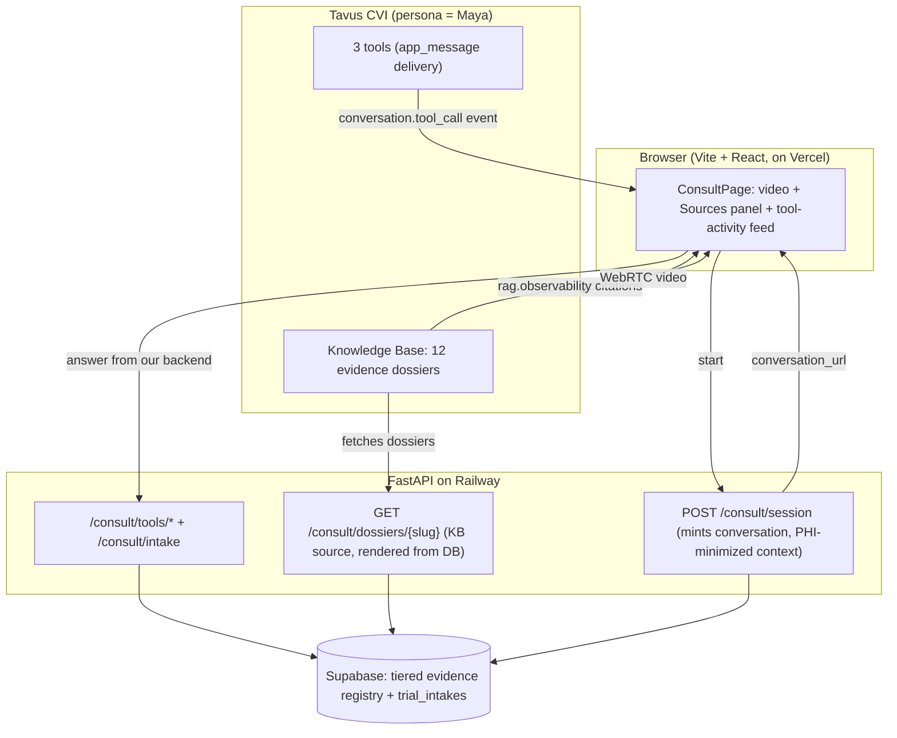

# PepHouse Consult - a real-time evidence-grounded video concierge

Consult is a Tavus CVI video agent layered onto PepHouse, an evidence-tiered
registry for peptides. A user talks to a clinician-style persona (Maya) about a
compound they are curious about; every claim she makes is grounded in the
registry and cited on screen, and the session ends by referring the user to a
licensed provider. She educates and screens - she never prescribes or doses.

**Live:** https://frontend-andre-chuabios-projects.vercel.app/consult
(click "Start consult", allow camera and mic).

Data is synthetic (Synthea) and Junction-sandbox. This is a hackathon project;
the evidence registry is our team's work, and Consult is the CVI layer added on
top of it.

## Why this project

Most peptides people take are not FDA-approved. They pursue them anyway, and the
honest need is not another storefront - it is grounded counsel and a path to a
licensed provider. That is the market (Immortals, Bryan Johnson's platform, is
the commerce version of it). Consult is the honest version: it meets people in
the grey area, tells them the truth about the evidence tier for what they want,
screens for safety, and hands a real provider a structured intake.

Two things make it defensible rather than another hype machine:

1. **It cannot make things up.** Every answer is grounded two ways - a knowledge
   base of per-compound evidence dossiers (cited live on screen) and tool calls
   into the same backend the rest of PepHouse uses. Maya names the evidence tier
   out loud: tier 4 published trials down to tier 1 forum anecdote. Anecdote-tier
   is never softened into something it is not.
2. **It stays in scope.** Maya never prescribes and never gives a dose; a
   licensed provider decides. An acute-emergency rule overrides the whole flow
   (chest pain now, self-harm - stop and direct to 911).

For a Customer Engineer read: this is what building on Tavus looks like when you
already have a real backend. The CVI layer reuses existing endpoints as tools,
so the agent is auditable in real time rather than a black box.

## Architecture



**Two grounding lanes.** Static reference evidence lives in the Knowledge Base
(the 12 dossiers, rendered on demand from the registry so they never go stale);
the KB fires `rag.observability` events that render a live, tier-tagged Sources
panel - the on-screen proof of the no-hallucination thesis. Anything computed
per-user (evidence lookups with exact figures, trial eligibility, the intake
write) is a tool call into the live backend, never a retrieval.

**Tool delivery is `app_message` (client-side).** A tool call arrives in the
browser as a `conversation.tool_call` event over the Daily data channel; the
frontend answers it from our backend and returns the result via
`conversation.tool_result`. This keeps the live Sources and tool-activity panels
effortless and needs no public webhook.

**The API key never touches the browser.** The backend holds the Tavus, Junction,
and Anthropic keys and calls those APIs server-side. The one endpoint Tavus calls
on us is `GET /consult/dossiers/{slug}`, which serves only already-public
registry data.

**PHI boundary.** Only flags and ranges (never raw lab values) are injected into
the Tavus conversation context; the intake record persisted for a coordinator is
run through a server-side scrubber (redacts measurements-with-units, contacts).

## Reproduce

Prerequisites: Python 3.11, Node 20+, a Supabase project, a Tavus account with
CVI minutes, keys for Anthropic and Junction (sandbox).

**Backend** (`backend/`):
```
python -m venv .venv && source .venv/bin/activate
pip install -r requirements.txt
cp .env.example .env   # fill: SUPABASE_URL, SUPABASE_SERVICE_ROLE_KEY,
                       # ANTHROPIC_API_KEY, JUNCTION_*, TAVUS_API_KEY
uvicorn main:app --reload
```

**Provision the persona + knowledge base** (one time):
```
python scripts/generate_dossiers.py        # 12 dossiers from the registry
# create the PAL + 3 tools via the Tavus API, set TAVUS_PAL_ID / TAVUS_FACE_ID
python scripts/register_kb.py --base <public backend url>   # upload KB, tag PAL
```

**Frontend** (`frontend/`):
```
npm install
# .env.local: VITE_SUPABASE_URL, VITE_SUPABASE_ANON_KEY
#             VITE_API_URL (optional; defaults to the hosted backend)
npm run dev
```

Deploy: backend as a Docker image on Railway, frontend on Vercel. Set the same
env vars in each platform. The dossier route renders from the database, so no
files ship in the container.

## Tests

`backend/test_consult.py` (48 tests): PHI minimization, the eligibility
never-refuses path, intake round-trip, biomarker extraction, dossier slug
canonicalization. `npx tsc --noEmit` and `npm run build` are clean.
